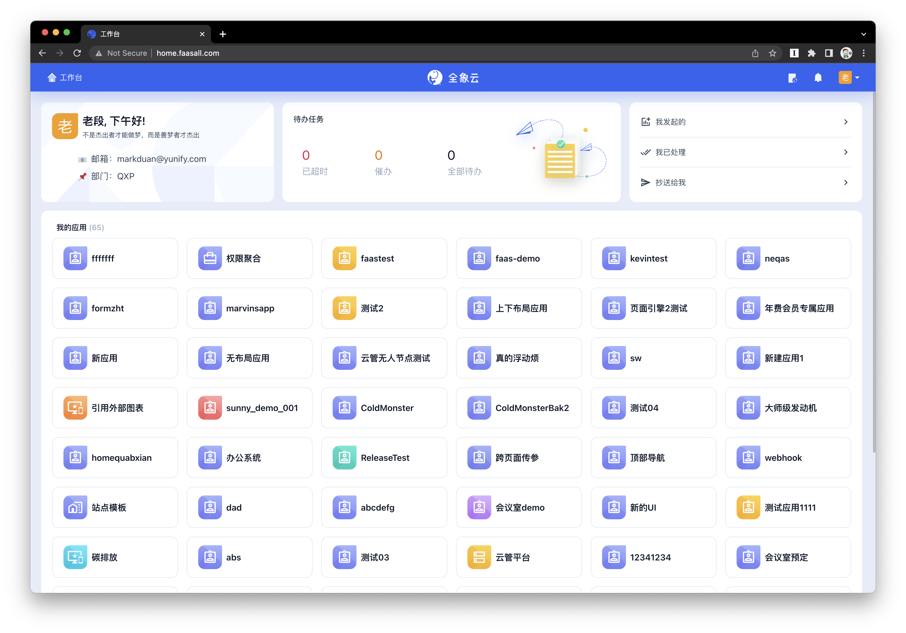
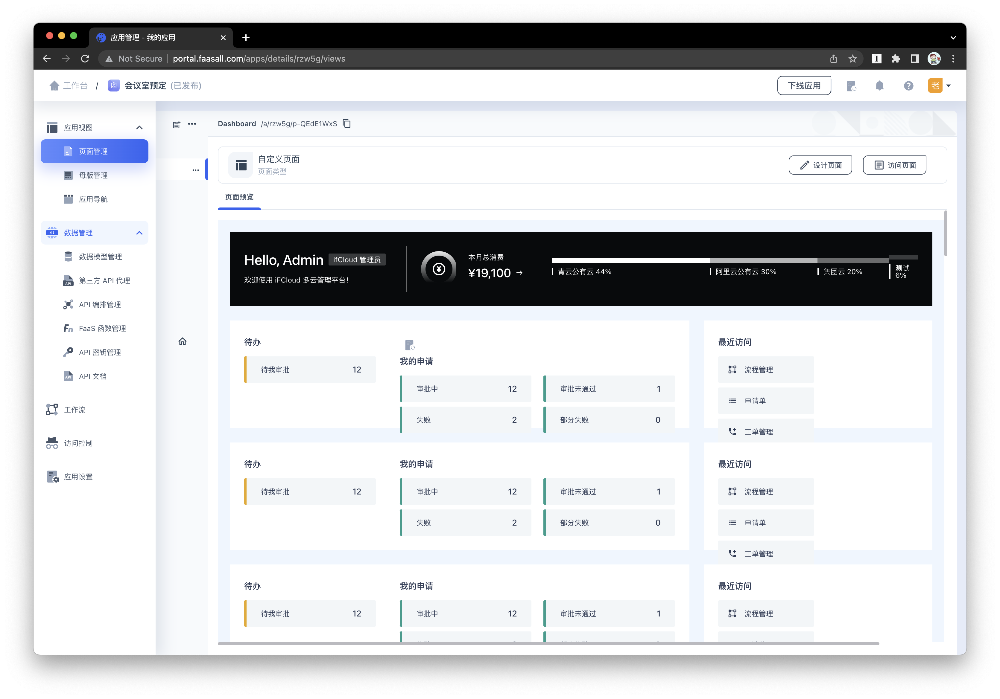

# QXP Web - 全象 QuanXiang 低代码平台管理和用户端

用户端截图

管理端截图

## 关于全象低代码平台

全象低代码平台成立于 2020 年底，经过两年多的开发，我们已经完成了低代码领域中众多核心功能，例如：

- `表单引擎` 无需编码，通过可视化拖拽的方式构建复杂且严肃的业务表单，并生成相应的 CRUD 接口
- `页面引擎` 无需或者少量编码，也是通过可视化拖拽的方式搭建页面，支持循环/条件渲染，组件库丰富且可扩展
- `数据模型管理` 支持定义模型和模型之间的关系，自动生成相应的 API，无需关心底层数据库和扩容等问题
- `API 代理` 支持注册/调用第三方 API，隐藏了鉴权和协议等细节，实现了与外部系统的无感集成
- `API 编排` 支持组合平台内部 API/第三方 API/FaaS API 等，支持串行和条件调用等
- `FaaS 函数` 支持定义和构建 Golang FaaS，并自动注册和生成 API 文档
- `工作流` 支持审批、填写、数据更新、数据新增、webhook、推送通知、延迟执行等多种功能的组合编排
- `访问权限控制` 提供细粒度的 RBAC 方式 API 访问权限控制

全象低代码平台完全基于云原生，[部署方便](https://github.com/quanxiang-cloud/quanxiang#installation)，能够有力支持企业的数字化需求。

## 关于 QXP Web

本项目是全象低代码平台的 web 端，包含了管理与开发端 Portal，用户端 Home 和部分移动端的代码，项目技术栈主要为 React + Typescript 和 Golang，其中前端的部分核心组件在 [one-for-all](https://github.com/quanxiang-cloud/one-for-all) 开源项目中。

关于 QXP Web 的架构和详细技术实现请参阅[项目文档](docs/index.md)。
