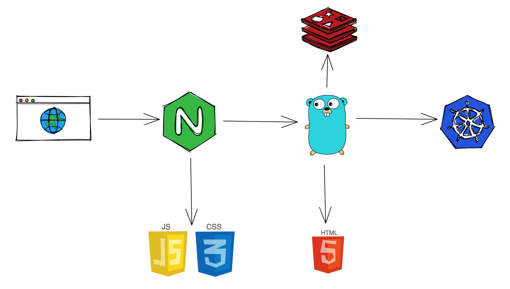

# 架构和技术栈

`qxp-web` 是一个大前端项目，也就是采用了服务端渲染和客户端渲染结合的方式，整体架构如下图所示。



请求从浏览器发出，会首先到达 nginx；根据路由规则，nginx 会将动态请求转发到 web server 上，对于静态请求则直接返回相应的静态文件；web server 在收到请求后会判断用户的 token 是否有效，然后返回渲染好的 HTML 或者将请求转发到后端，用户的 session 等信息会缓存在 redis 中。

相比于其他纯前端项目，将 web server 放置于 client 和 API 之间大大提高了前端的灵活性，减少了很多不必要的冗余。例如，当需要用户登录时，可以直接由 web server 返回一个 302 重定向状态，web server 也可以记录当前用户访问的 URL 地址，等用户登录后再跳转回前面访问的地址；由 web server 来转发前端请求避免了跨域的问题，同时向客户端屏蔽了 token 的概念和相关 refresh 逻辑；web server 可以按照前端的需求提供一些聚合的 API，而不依赖后端开发人提供，在减少沟通成本的同时更缩短了网络请求路径。

## Web Server

`qxp-web` 的 web server 采用 golang 编写；使用内置的 `net/http` 实现 web handler；使用 [gorilla/mux](https://github.com/gorilla/mux) 来构建路由；使用内置的 `html/template` 库来渲染 HTML；redis client 使用的是 [go-redis](https://github.com/go-redis/redis)。

Web server 分为 `portal` 和 `home` 两个服务，他们的入口分别为 `server/cmd/portal/main.go` 和 `server/cmd/home/main.go`。因为一些历史原因，这两个服务没有完全分开，而是共用了很多代码，下面我们以 portal 服务为例，介绍一下路由的定义。

### 服务端路由

路由定义在 [server/pkg/portal/routes.go](server/pkg/portal/routes.go) 文件中，这里对其中的一些重要路由做一些详细介绍。

#### 前端 API 请求转发

```golang
r.Headers("X-Proxy", "API").HandlerFunc(tokenRequired(handlers.ProxyAPIHandler))
```

`gorilla/mux` 的能力非常强大，除了支持定义 `path` 路由匹配规则外，还支持定义 `header` 匹配规则。有了 `header` 规则的支持，前端构造 API 请求就不需要在请求地址前加 prefix，web server 也不需要在转发时将 prefix 删除。

在前端，我们提供了封装好的 [http-client](clients/lib/http-client.ts)，这个 client 在发送请求时会在 header 中增加 `X-Proxy: API`，`gorilla/mux` 在收到有此 header 的请求后会调用 `ProxyAPIHandler`。在 `ProxyAPIHandler` 中会构造一个 golang 语言的 HTTP Request，加上调用 API 所要求的 `token` 等信息，发送请求，返回 API 的 response 到前端。

#### 聚合查询 Artery 和 Swagger 的路由

```golang
r.Path("/api/page_schema_with_swagger").Methods("GET").Handler(tokenRequired(handlers.HandleGetSchema))
```

在使用 [artery-renderer](https://github.com/quanxiang-cloud/one-for-all/tree/main/packages/artery-renderer) 渲染页面时，需要提供 [Artery](https://github.com/quanxiang-cloud/one-for-all/tree/main/packages/artery) 和 Swagger JSON，这里的 Swagger JSON 并不是提前写好的，而是需要根据在 Artery 中的 APIStates 的定义动态组合而来。

后端提供了传入 API ID 列表返回组合好的 Swagger JSON 的 API，前端只要根据 Artery 来导出 API ID 列表，然后调用这个 API 即可。这部分逻辑如果放在浏览器端实现会有很长的网络请求路径，而 web server 和 API 是部署在同一个内网中的，所以由 web server 来提供一个同时返回 Artery 和 Swagger JSON 的聚合 API 会极大的缩短页面渲染需要的等待时间。

#### 渲染 HTML 的默认路由

```golang
r.PathPrefix("/").Methods("GET").HandlerFunc(loginRequired(handlers.PortalHandler))
```

此路由放在了最后位置，当前面的路由匹配规则没有命中时，请求就会落到此路由上，返回 HTML 然后由前端渲染。
