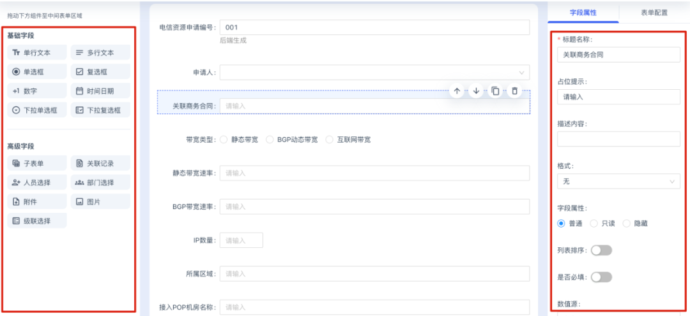
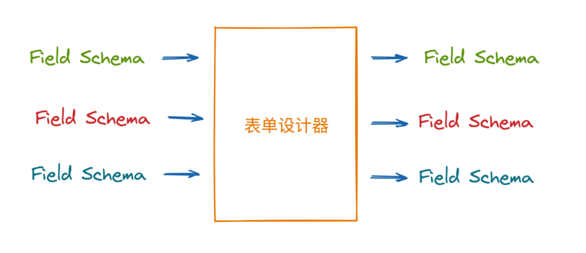
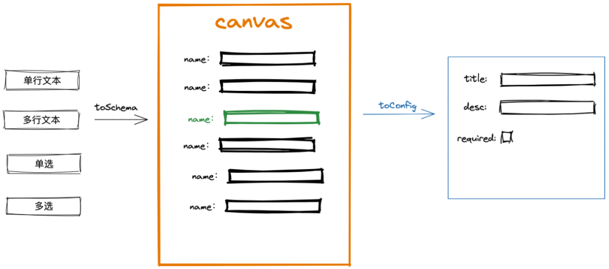

# 基于 Formily 的表单设计器实现原理分析

在控制台类 web 应用中，表单是最常见的交互形式。用户在表单中填写信息，点击提交就能完成对数据创建或者修改操作。

最开始，前端开发人员根据业务模型和具体需求，通过逐一编写或者声明实现表单中的各个字段，测试通过之后发布上线。渐渐的，开发人员开始把一些常用的方法抽象成表单库复用，提升开发效率。随着业务复杂度的增加和需求的不断演进，对表单的展示形式和灵活程度要求也在不断提高，现有的表单库只能解决部分问题，开发者仍需花费大量的精力在更新表单字段或者开发新表单上。

那有没有一种方式，既能让开发人员快速构建表单，同时在后期又很少或者根本不需要开发人员介入来更新表单呢？

此时，表单设计器应运而生。表单设计器提供了可视化界面，让非专业开发人员也能通过拖拽的方式，所见即所得的构建业务所需表单。

## 表单设计器样式

目前很多开源的表单设计器实现，在 UI 上都大同小异，设计器的结构类似设计软件的布局。表单设计器一般为左中右三栏布局:

左侧是控件列表，列出了设计器支持的表单控件；

中间部分是画布（canvas） ，左侧的控件可直接拖拽到画布中，并支持控件调整顺序、复制等操作；

右侧是表单字段的配置区域，在画布中选中一个字段，右侧将展示此字段的所有属性，用户可在此处配置字段标题、描述、校验规则等。



## 原理解析

表单设计器的输出是一份描述表单字段的 **JSON Schema**，表单设计完成后 JSON Schema 将直接存储到后端。表单发布后，前端再根据 JSON Schema 渲染表单。表单中所有字段的信息都是存储在 Schema 中，所以每次对表单的更新都是修改 Schema 中的内容，无需传统的编译过程。借助表单设计器，不但将开发人员从应对业务变更的频繁改动中解放出来，同时大大提高了非专业开发人的生产力，较少了沟通成本。

JSON Schema 是表单设计器和表单渲染组件之间沟通的语言。要理解表单设计器的核心，首先要理解 Schema。在实际的项目中，JSON Schema 一般比较复杂，此处不做展开。本文的主题是表单设计器的实现原理，主要关心的是如何提供一个可视化界面，让用户能够快速生成 Schema，Schema 的详细格式将在后续文章中介绍，这里先提供一个简化版本的定义：

```typescript
interface Schema {
  fields: Record<FieldKey, FieldSchema>;
}

interface FieldSchema {
  title: string;
  type: 'string' | 'object' | 'array' | 'number' | 'boolean';
  component: string;
  componentProps: {
    [name: string]: any;
  };
}
```

众所周知，表单由多个 input 控件组成，input 控件包含多种形式，如：文本、数字、单选和多选等。Schema 中除了描述字段对应的是哪种类型的 input 外，还需要描述控件的行为，例如是否限制输入长度，是否必填等。有了这些描述后，表单渲染组件才能根据 Schema 渲染出符合预期的表单。

在上面的类型定义中：

- component 表示该字段用什么 input 组件渲染；
- componentProps 表示传给组件的 props，用于控制组件的行为；
- type 表示组件接受和期望返回的数据类型；
- FieldKey 是字段在表单中的唯一标识，用户侧不透出；
- title 表示表单中字段对应的 label，它的值用户可读。

表单设计器的任务就是从零开始，或者将已有的 JSON Schema 作为输入，对 Schema 中的字段做添加、删除和更新操作，最后输出 Schema。如果我们把表单设计器看成一个整体，那它的功能可以用下图表示：


进一步讲，我们可以将上图拆分到控件级别，以一个字段的配置作为输入，经过更新后重新输出这个字段的配置。



整体来看，表单就是对每个控件的操作进行组合，组合的结果就是完整的 JSON Schema。

为了能够实现对表单字段的修改，我们在表单设计器中提供了字段配置区域，用户在配置区域中，可以通过可视化方式定义字段属性，而无需关心 Schema 的具体格式。表单设计器负责将配置值转化成 Schema，同时也负责将 Schema 转化成配置值，用来回显配置后的页面表单。

想要完成上述功能，每种控件都需要实现两个方法：toConfig 和 toSchema。这里用一个公式来表示这两种方法和 Schema 的关系，其中 configValue 用来给配置表单做回显。

```text
FieldSchema => toConfig => configValue => toSchema => FieldSchema
```

厘清了上述思路之后，我们再回到表单设计器的 UI 呈现上来。



左侧是设计器支持的控件列表，根据上面的分析，每个控件都需要提供控件名称、配置表单、toConfig和 toSchema 这四个接口的实现。中间的 canvas 负责展示 Schema 中的控件，同时需要处理用户的点击和拖拽事件。当用户点击 canvas 中的某个字段时，右侧的配置区域需要找到对应的配置表单并渲染出来。

## 总结

以上是表单设计器最核心的架构实现，还有一些实现上需要考虑的细节，如表单 Schema 定义解析等将在后续的文章中逐步阐述，请大家持续关注。

全象云低代码平台的表单设计器是基于 Formily 实现的。Formily 的灵活扩展能力和为业务而生的特性让我们钦佩，感谢 Formily 团队的贡献，希望我们后面也能为 Formily 贡献代码。
