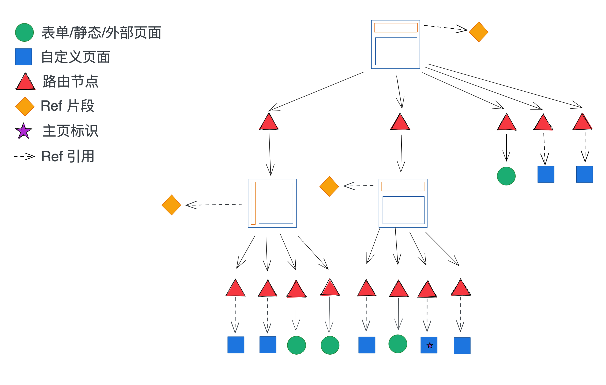

# 页面编排 - AppLand 的实现

AppLand，既在 Portal 端构建的应用的访问端。

我们提供了一种灵活且开发难度适中的页面编排方案，能够满足大部分企业的业务需求。在详细介绍方案之前我们需要先了解布局的概念。

## 布局

布局是指上下、左右等常见页面结构，布局有且只有两部分组成。一部分是可以自定义内容的公共区域，一部分是用来承载具体`页面`的容器。

用更直接的话说就是，我们期望开发者在布局的公共部分放导航、logo 或者其他公共的页面元素。布局中的容器用来放表单页面、自定义页面、iframe 页面等，具体显示哪个页面由当前浏览器的 URL 决定。

在 Portal 端，为了让用户更容易理解，我们`母版`这个概念来替代布局，也可以类比为 PPT 的母版。

布局在结构上有上下布局和左右布局，在使用范围上分为应用级别和页面级别。应用级别的布局会影响到整个应用的所有页面，或者说所有页面都会在应用布局里。页面布局是应用布局里的子布局，页面布局出现在应用布局的容器区域内，页面布局不支持再嵌套。

## 页面结构方案

整理一下我们见过的页面，大部分是顶部导航 + 内容区域或者左侧导航 + 右侧内容区域的结构。前面介绍的布局，就是为了满足这类需求。当然实际的页面结构还有很多，我们的目标也是也满足大部分的场景需求。

使用 Artery + Artery Renderer 我们不但可以渲染单个页面，更可以完成整个单页面应用的渲染。为此可以用下图来说明整个 AppLand 的页面结构。

如果你是一位前端开发者，并且开发过单页面应用，那图中的结构应该非常容易理解。其实上图中的结构，在 Pro Code 的场景中同样适用，不过这里我们为了降低开发难度，只提供了两层布局的嵌套。

在确定了页面结构之后，我们需要做的就是在 Portal 端提供编辑此结构的能力，而这个结构也是用 Artery 来表示的，那最后的操作就是落到了对 Artery 的解析和编辑上。

### 屏蔽细节的 Orchestrator

Artery 的结构并不复杂，我们编写了一个抽象的对象 [orchestrator](https://github.com/quanxiang-cloud/qxp-web/blob/develop/clients/portal/modules/apps-management/pages/app-details/view-orchestration/orchestrator.ts)，将对 Artery 的修改操作抽象成了修改、添加页面和布局等接口。

Orchestrator 会 parse artery，直接返回页面列表和布局列表，同时提供了相应的修改和删除方法等，**orchestrator 也屏蔽了路由的概念**。

### AppLand 路由结构

为了简化开发难度，我们在 Portal 端屏蔽路由的概念，但是如果你是有经验的开发者，并且在 Home 端有需要知道当前路由的需求，可以参考 AppLand 的页面结构图和下面的路由规则说明：

- AppLand 的所有页面都在 path `/a/<appID>` 下，包括应用的主页
- 如果一个页面不在某个页面布局（模板）里，那它的访问 path 为 `/a/<appID>/<p-xxx>`
- 如果一个页面在页面布局内，那它的访问 path 为 `/a/<appID>/<l-xxx>/<p-xxx>`
- `p-xxx` 表示对应的是`页面`，`p-` 是固定前缀，`xxx` 在实际中是随机生成的字符串
- `l-xxx` 表示对应的是`布局`，`l-` 是固定前缀，`xxx` 含义同上

在 Artery 和组件内部，可以直接通过 `window.location.pathname` 获取当前浏览器的 path，然后按照上述规则 parse 出自己需要的部分。

在 Artery 的 functional property 中，可以通过 `this.history` 获得 [history](https://github.com/remix-run/history/blob/3e9dab413f4eda8d6bce565388c5ddb7aeff9f7e/packages/history/index.ts#L188) 对象，也可以写 `this.history.push('/to/some/path')` 实现页面跳转。
