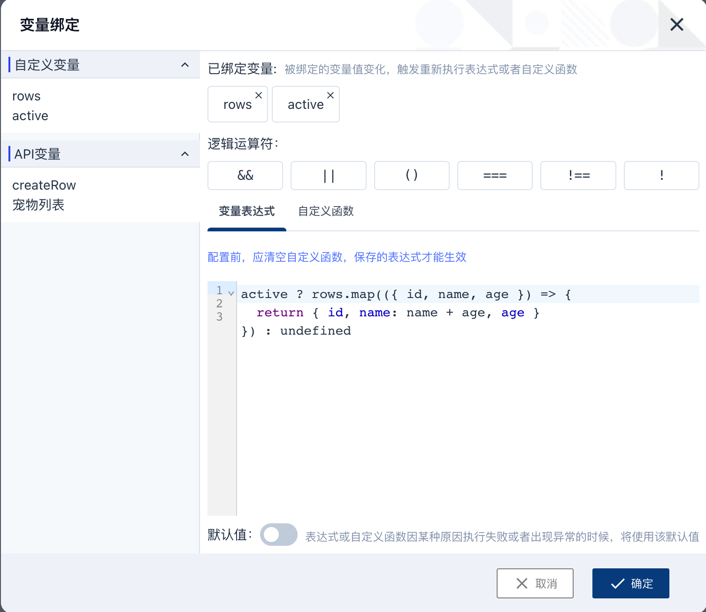
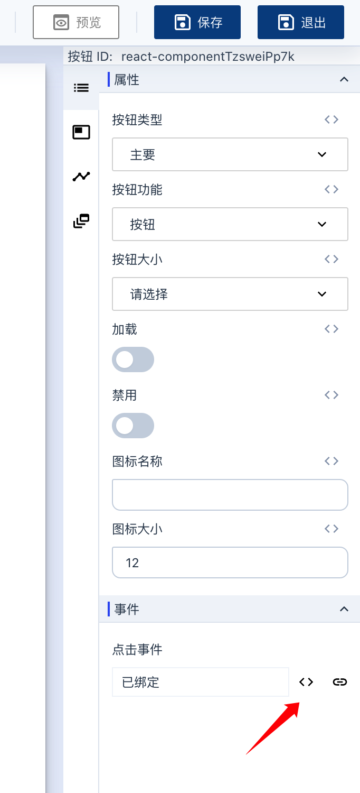

# 页面引擎使用说明

页面引擎提供了通过可视化拖拽的方式构建页面。页面引擎主要有三部分组成：做的全局功能区，中间的画布 canvas 和右侧的组件配置区。

## 全局功能区

全部功能区有一下主要功能：

- **组件库**：目前平台提供了系统组件、图标库和 headless-ui 三套组件，可以将组件库中的组件拖拽到 canvas 中，如果想新增组件库或者组件，请参考[自定义组件开发](04-user-defined-components-development.md)。
- **页面层级**：展示了当前页面的元素层级结构，同时支持拖拽调整元素顺序。
- **数据源**：配置当前页面使用的共享状态和 API，共享状态的即为页面中的所有元素都可以使用的状态。
- **区块模版**：可以将页面中的部分元素保存成区块模版，全局复用。

## 画布 canvas

画布 canvas 提供了页面预览功能。在 canvas 中，你可以选中页面元素然后在右侧的组件配置区对其进行自定义配置。当选中某个元素后，元素会使用蓝色边框高亮显示，同时在边框上方的工具条中，展示了元素的层级路径，复制 icon 和删除 icon。

当鼠标 hover 到工具条中的元素层级路径时，会展开显示当前选中的元素的父级元素，点击可以切换到父级元素。

## 组件配置区

组件配置区由四部分组成：

- **属性配置**：配置组件支持的各个属性，具体展示哪些属性由组件的 props spec 决定，请参考[自定义组件开发](04-user-defined-components-development.md)。
- **组件样式配置**：配置组件的 inline css 类型的 property，当组件有多个 inline css property 时，会有 property 切换功能。
- **组件生命周期配置**：支持配置组件加载完成和卸载前两个时间点的 hook 配置。
- **动态渲染配置**：支持配置组件的条件渲染和循环渲染逻辑。

## 数据绑定和事件定义

### 数据绑定

页面中的状态分为两类：一是同步的本地的共享状态，任何组件都可以读取其或者更新它的值；二是 API 状态，可以将 API 请求的 response 传给组件，API 的调用需要在`事件`中完成。

在全局功能区中的**数据源**板块可以定义共享状态和 API 状态，然后点击下图中的 icon 可以打开数据绑定对话框。




如果要将状态传给组件，需要先在 modal 中选择要绑定的状态。绑定的状态不一定是组件预期的数据格式，可以通过`变量表达式`或者`自定义函数`做数据转化，两者都必须是合法的 JavaScript 语法。

`变量表达式`就是一行 JavaScript 代码，不能在外层写 if-else 等逻辑判断，因为输入的内容前面会被渲染引擎补充上 `return` 关键字。例如在上图中选择了 `rows` 和 `active` 这两个状态，如下的写法是合法的

```javascript
active ? rows.map(({ id, name, age }) => {
  return { id, name: name + age, age }
}) : []
```

`自定义函数`适用于对数据处理逻辑更复杂的场景，开发者可以在自定义函数中写复杂的判断逻辑。自定义函数的参数有且只有一个 `state`, `state` 是一个对象，对象中的 key 就是选择的状态名称，value 即为状态值。

注意，请在自定义函数内部写逻辑，在外部写的代码无法被识别。

同样例如上面的截图，选择了 `rows` 和 `active` 这两个状态，如下的自定义函数是合法的

```javascript
// rows 是一个数组，可以传给 table 组件
function convertor(state) {
  if (state.active) {
    return states.rows.filter(({ isActive }) => isActive);
  }

  return states.rows;
}
```

### 事件定义

事件是常见的组件对外暴露的接口，我们可以在事件中发 API 请求或者修改某个状态值等。在属性配置中，点击绑定事件 icon 可以看到事件定义 modal。



组件事件的参数有组件的实现决定，为了通用，这里使用 `...args` 表示。事件在执行时会被绑定上当前页面的共享状态、API 状态和路由对象，下面举例说明一下常见操作。

#### 共享状态

如果要在事件中使用共享状态，可是通过 `this.states.someStateID` 的形式获取，`this` 是绑定的 function 执行上下文，`states` 是共享状态的合集。

```javascript
// 获取共享状态
const foo = this.states.foo;
const { bar } = this.states.foo;
const baz = this.states.foo.bar;

// 修改共享状态
this.states.foo = 'some_value';
this.states.someList = [...this.states.someList, { id: 'abc', name: 'tom' }];

// 这种写法不支持
this.states.foo.bar = 'some_value';
```

### API 状态

API 状态只有在请求发出之后才能有值，发送 API 请求的操作可以在事件或者生命周期里执行。

```javascript
// 获取 API 状态
const data = this.apiStates.someStateId.result;

// 调用 API, callback 在请求完成之后执行，可以不传
this.apiStates.someStateID.fetch({ params: { id: 'some_value' }, body: { } }, callback);
```

### history 状态

```javascript
this.history.push('/path/to/some/page');
```

当然，一个事件中，共享状态，API 状态和 history 是可以同时使用的。
